# 组会汇报：自动化控制系统

## 从通信协议到项目实现

---
layout: default
---

# 目录

<div class="grid grid-cols-2 gap-4 mt-6">
<div>

**基础与原理**
- 一、串口通信原理 ⬅️ 基础知识
- 二、电平标准与接口

**编程与协议**
- 三、Python串口编程
- 四、AIBUS协议详解

</div>
<div>

**项目实现**
- 五、项目架构设计
- 六、核心代码实现

**演示与展望**
- 七、演示与总结

</div>
</div>

---

# 一、串口通信原理

---

## 1.1 什么是串口通信？

### 生活类比：两个人聊天 💬

| 对比项 | 生活场景 | 串口通讯 |
|--------|----------|----------|
| 通讯双方 | 两个人 | 两台设备（电脑 ↔ 单片机） |
| 通讯通道 | 空气/电话线 | 串口线（USB线/RS-232线） |
| 通讯规则 | 语言/语速/停顿 | 波特率/数据位/校验位 |

> **核心本质**：数据以"位（bit）"为单位，一位一位地**串行传输**

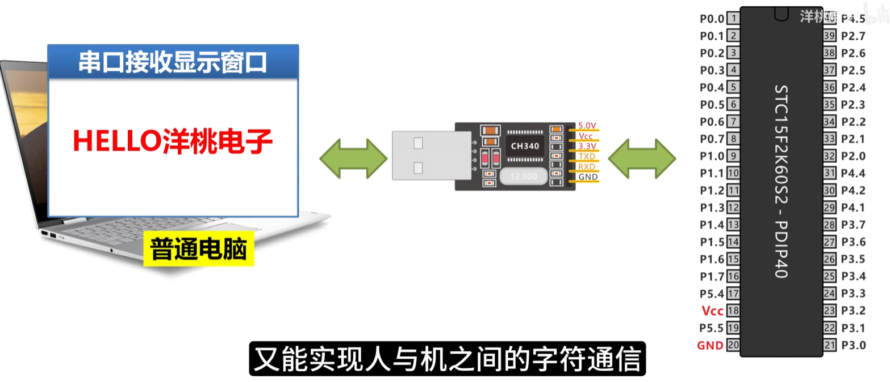

---

## 1.2 串行 vs 并行传输

<div style="display: flex; gap: 24px; align-items: flex-start; margin-top: 8px;">
<div style="flex: 1;">

**并行传输的缺点**：
- ❌ 线路多（8根以上）
- ❌ 距离短（通常<1米）
- ❌ 成本高 / 抗干扰差

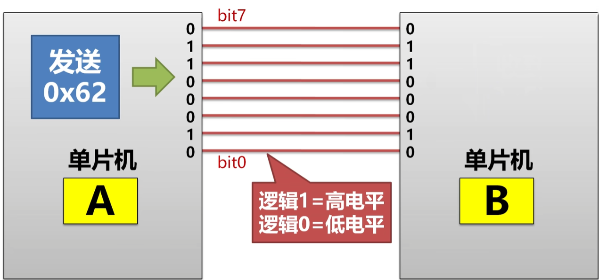

</div>
<div style="flex: 1;">

**串口通讯的优势**：
- ✅ 线路少（最少仅需3根）
- ✅ 距离远（RS-485可达1200米）
- ✅ 成本低 / 抗干扰强

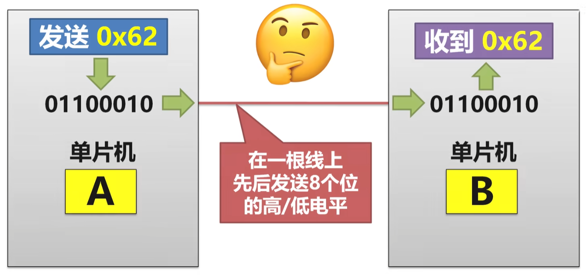

</div>
</div>

---

## 1.3 串口通讯的应用场景

### 串口通讯无处不在

| 领域 | 典型应用 |
|------|----------|
| 🖥️ 嵌入式开发 | 单片机程序下载、调试输出 |
| 🏭 工业控制 | PLC、变频器、传感器互联 |
| 🏠 智能家居 | 门禁、网关、温湿度传感器 |
| 🚗 汽车电子 | OBD车载诊断系统 |
| 🖨️ 办公设备 | 老式打印机、扫描仪 |

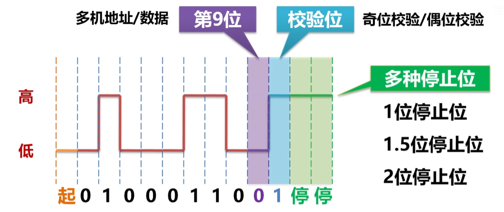

---

## 1.4 数据帧结构

### 串口传输的基本单元

一帧完整的串口数据包含：

```
┌────────┬──────────┬────────┬────────┐
│ 起始位 │  数据位  │ 停止位 │ 校验位 │
│ 1 bit  │ 5-8 bit  │ 1-2bit │0/1 bit │
└────────┴──────────┴────────┴────────┘
   ↓        ↓         ↓        ↓
  开始标志  有效数据   结束标志  纠错用
```

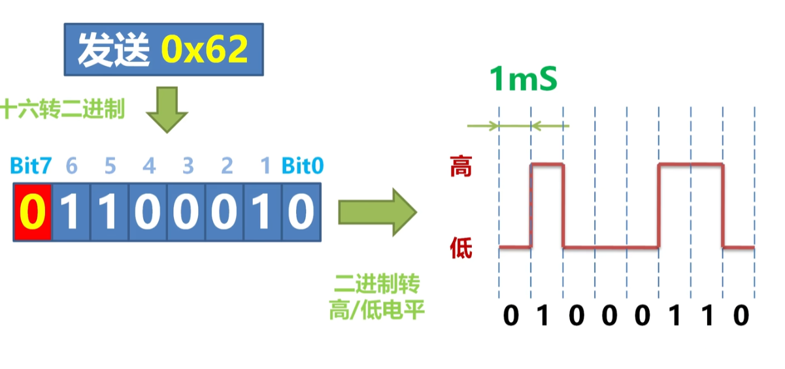

---

## 1.5 数据帧示例

### 发送字符 'A'（8N1配置）

**ASCII码**: `0x41` = 二进制 `01000001`

```
空闲   起始   D0  D1  D2  D3  D4  D5  D6  D7   停止   空闲
  1      0     1   0   0   0   0   0   1   0     1      1
        └──────────────────────────────┘
                  一个完整数据帧
```

> 📝 **时序说明**：先传低位(D0)，后传高位(D7)

---

## 1.6 串口四件套

### 确保双方能正常通讯的核心参数

| 参数 | 类比 | 说明 | 常见值 |
|------|------|------|--------|
| **波特率** | 聊天语速 | 每秒传输位数(bps) | 9600, 115200 |
| **数据位** | 每个词字数 | 每帧数据位数 | 7, 8 (常用8) |
| **停止位** | 说完停顿 | 帧结束标志 | 1, 2 (常用1) |
| **校验位** | 确认听懂 | 检错机制 | N/O/E (常用N) |

> ⚠️ **关键**：发送方和接收方的参数必须**完全一致**！

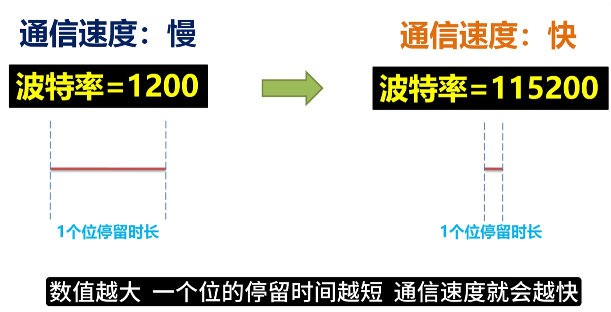

---

## 1.7 波特率选择

### 波特率与传输速度对照

| 波特率 | 字节/秒 | 典型应用 |
|--------|---------|----------|
| 9600 | ~960 | 工业仪表、传感器 |
| 19200 | ~1920 | PLC通信 |
| 115200 | ~11520 | 调试下载、高速通信 |

> 💡 **经典配置**：`9600 N 8 1`（9600波特率，无校验，8数据位，1停止位）

<div style="display: flex; gap: 16px; justify-content: center; margin-top: 8px;">
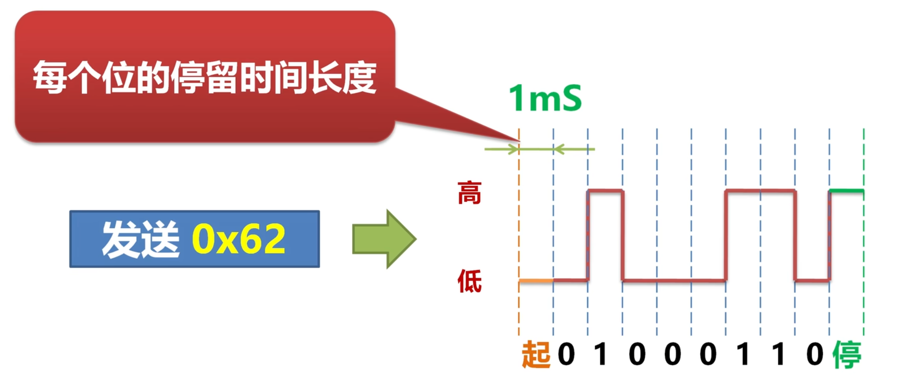
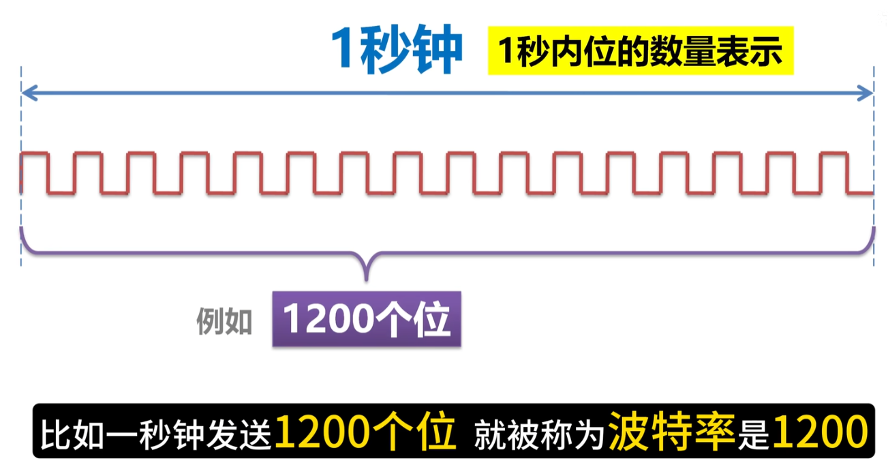
</div>

---

## 1.8 通讯方向

### 三种通讯模式

| 类型 | 类比 | 特点 | 典型应用 |
|------|------|------|----------|
| **全双工** | 打电话 | 双方可同时说/听 | UART（TX+RX双线） |
| **半双工** | 对讲机 | 同一时间只能一方传输 | RS-485总线 |
| **单工** | 广播 | 只能单向传输 | 传感器→控制器 |

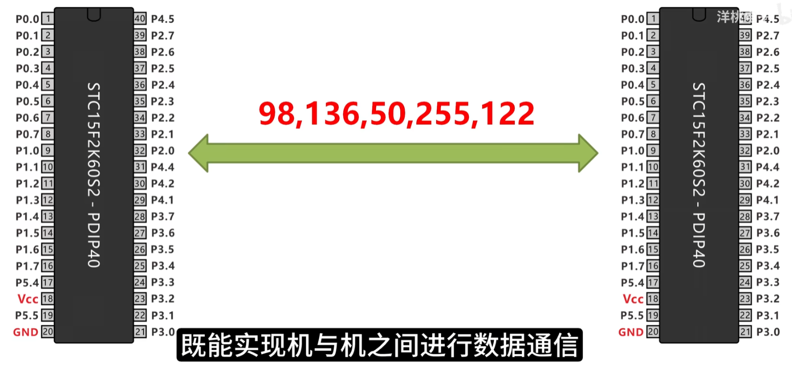

---

## 1.9 接线方式

### 全双工接线规则：TX接RX

```
┌─────────────┐                    ┌─────────────┐
│    设备A    │                    │   设备B    │
│             │                    │             │
│  TX ──────────►───────────────────►── RX      │
│  RX ◄───────────────────────────────◄── TX    │
│  GND ────────────────────────────────── GND   │
└─────────────┘                    └─────────────┘

✅ 规则：TX → RX，RX → TX（交叉连接）
❌ 错误：TX → TX，RX → RX
```

> 💡 **最小系统只需3根线**：TXD、RXD、GND

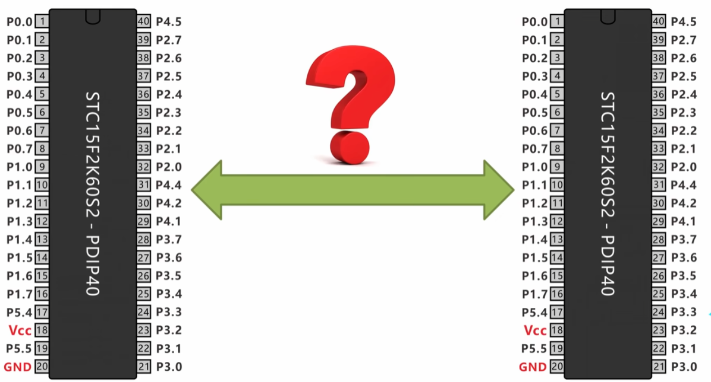

---

## 1.10 电脑如何连接单片机？

### USB转串口方案

**为什么需要转换？**
- 电脑USB口 → USB信号
- 单片机串口 → TTL电平（0~5V）
- 需要 **USB转TTL模块**（如CH340）

<div style="display: flex; gap: 16px; justify-content: center; margin-top: 8px;">

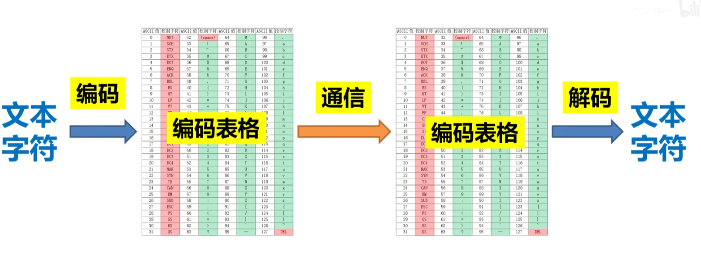
</div>

---

## 1.11 电平标准对比

### 物理层的三种接口

| 标准 | 信号类型 | 逻辑1 | 逻辑0 | 特点 | 距离 |
|------|----------|-------|-------|------|------|
| **TTL** | 单端 | 2.4~5V | 0~0.4V | 芯片直连 | <1米 |
| **RS-232** | 单端(负电平) | -15~-3V | +3~+15V | 抗干扰差 | <15米 |
| **RS-485** | 差分信号 | A-B>+200mV | A-B<-200mV | 抗干扰强 | 1200米 |

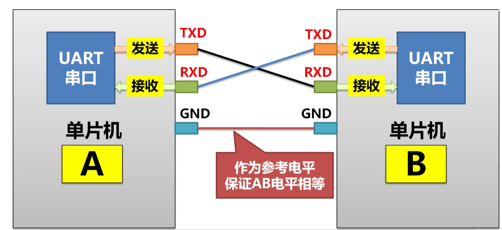

---

## 1.12 RS-232 接口

| 逻辑 | 电压范围 | 说明 |
|------|----------|------|
| 逻辑1 (高) | **-15V ~ -3V** | 负电压！ |
| 逻辑0 (低) | **+3V ~ +15V** | 正电压！ |

> 🔴 **警告**：RS-232电平**绝对不能**直接连接TTL设备！
> 必须使用 MAX232 等电平转换芯片。

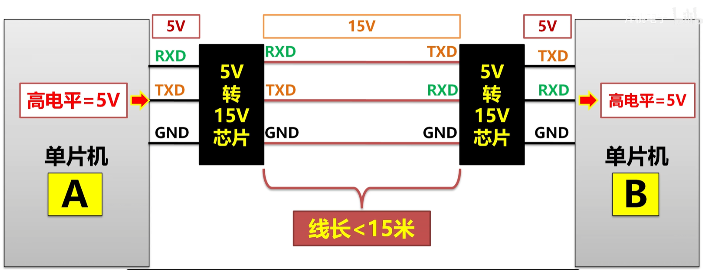

---

## 1.13 RS-485 接口

RS-485采用**差分信号**传输：

| 特性 | 说明 |
|------|------|
| 传输方式 | 差分信号 (A线 - B线) |
| 逻辑1 | A - B > **+200mV** |
| 逻辑0 | A - B < **-200mV** |
| 最大距离 | **1200米** |
| 最大节点 | **32个设备** |

> ✅ **优点**：一根总线可连接最多32个设备，最远1200米

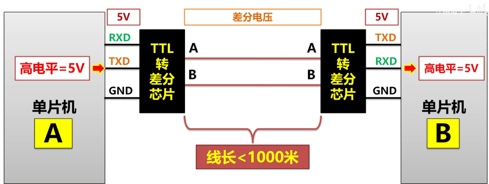

---

## 1.14 RS-485 总线拓扑

### 一主多从连接方式

```
                    ┌──────┐
                    │ 主站 │
                    └──┬───┘
                       │
    ┌───────────────────┼───────────────────┐
    │                   │                   │
┌───┴───┐          ┌───┴───┐          ┌───┴───┐
│ 从站1 │          │ 从站2 │          │ 从站3 │
└───────┘          └───────┘          └───────┘
    A+──────────────A+──────────────A+
    B-──────────────B-──────────────B-
    GND─────────────GND─────────────GND
```

---

## 1.15 工作流程总结

### 以发送字符 'A' 为例（9600 N 8 1）

```
┌──────────────────────────────────────────────────────┐
│                      通讯流程                          │
├──────────────────────────────────────────────────────┤
│  1️⃣ 参数约定  │ 双方设置 9600波特率、无校验、8数据位    │
│  2️⃣ 数据转换  │ 'A' → ASCII 65 → 二进制 01000001       │
│  3️⃣ 串行发送  │ TX线按波特率逐位发送（先低位后高位）     │
│  4️⃣ 数据接收  │ RX线按相同波特率接收8位+1位停止位       │
│  5️⃣ 数据还原  │ 二进制 01000001 → ASCII 65 → 'A'       │
└──────────────────────────────────────────────────────┘
```

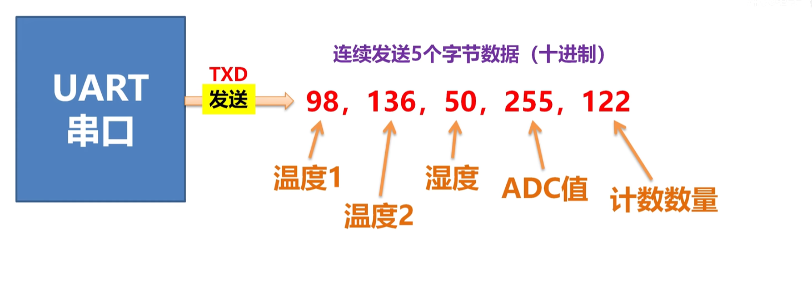

---

# 二、电平标准与接口

---

## 2.1 TTL电平详解

TTL (Transistor-Transistor Logic) 是芯片级数字电平标准：

| 逻辑 | 电压范围 | 典型值 |
|------|----------|--------|
| 逻辑1 (高) | 2.4V ~ 5V | 3.3V / 5V |
| 逻辑0 (低) | 0V ~ 0.4V | 0V |

> ⚠️ **注意**：3.3V设备不能直接接5V设备，需电平转换！

---

## 2.2 串口引脚定义：DB9接口

| 引脚 | 名称 | 方向 | 功能 |
|------|------|------|------|
| 2 | **RXD** | 输入 | 接收数据 |
| 3 | **TXD** | 输出 | 发送数据 |
| 5 | **GND** | - | 信号地 |
| 7 | RTS | 输出 | 请求发送 |
| 8 | CTS | 输入 | 清除发送 |

---

# 三、Python串口编程

---

## 3.1 pyserial库简介

Python最常用的串口库：

```bash
pip install pyserial
```

**核心功能**：
- ✅ 串口打开/关闭
- ✅ 数据发送/接收
- ✅ 参数配置
- ✅ 超时控制

---

## 3.2 串口基本操作

```python
import serial

# 打开串口
ser = serial.Serial('COM3', 9600, timeout=1)

# 发送数据
ser.write(b'\x80\x80\x52\x00\x00\x00\x52\x00')

# 接收数据
data = ser.read(10)  # 读取10字节

# 关闭串口
ser.close()
```

---

## 3.3 推荐写法：上下文管理器

```python
# ✅ 推荐方式：自动关闭串口，防止资源泄漏
with serial.Serial('COM3', 9600, timeout=1) as ser:
    # 发送指令
    ser.write(command)
    
    # 读取响应
    response = ser.read(10)
    
# 退出with块时自动关闭
```

---

## 3.4 串口配置参数详解

```python
ser = serial.Serial(
    port='COM3',           # 端口号
    baudrate=9600,          # 波特率
    bytesize=8,             # 数据位 (5,6,7,8)
    parity='N',             # 校验位 (N无/O奇/E偶)
    stopbits=1,             # 停止位 (1, 1.5, 2)
    timeout=1.0,            # 读超时(秒)
    write_timeout=1.0,      # 写超时(秒)
)
```

---

## 3.5 数据打包与解包

使用 `struct` 模块处理二进制数据：

```python
import struct

# 打包：数值 → 字节 (小端序 uint16)
data = struct.pack('<H', 1000)  # → b'\xe8\x03'

# 解包：字节 → 数值
value = struct.unpack('<H', b'\xe8\x03')[0]  # → 1000

# 多字段打包
frame = struct.pack('<HHB', 0x8080, 0x52, 0x00)
```

---

## 3.6 串口通信流程图

```
┌──────────┐                    ┌──────────┐
│   主机   │                    │   从机   │
│ (电脑)   │                    │ (仪表)   │
└────┬─────┘                    └────┬─────┘
     │                               │
     │  ──── 发送指令 ──────────────>│
     │       (8字节)                 │
     │                               │
     │  <─── 返回响应 ───────────────│
     │       (10字节)                │
     │                               │
```

---

## 3.7 Python自动化控制原理

### 整体架构

从用户操作到硬件控制，采用分层设计：

```
┌─────────────────────────────────────────────────────────────┐
│                    Python 应用层                             │
│  (控制脚本、业务逻辑、数据处理)                               │
├─────────────────────────────────────────────────────────────┤
│                    设备抽象层                                │
│  (BaseDevice, AIHeaterDevice - 统一接口)                    │
├─────────────────────────────────────────────────────────────┤
│                    协议层                                    │
│  (AIBUS协议 - 数据打包/解包、校验和计算)                      │
├─────────────────────────────────────────────────────────────┤
│                    通信层                                    │
│  (pyserial - 串口打开/关闭、数据发送/接收)                   │
├─────────────────────────────────────────────────────────────┤
│                    硬件层                                    │
│  (USB转串口、RS485/TTL、加热器设备)                          │
└─────────────────────────────────────────────────────────────┘
```

---

## 3.8 各层职责

| 层次 | 职责 | 关键技术 |
|------|------|----------|
| 应用层 | 用户交互、业务逻辑 | Python脚本、配置文件 |
| 设备层 | 设备操作封装 | 面向对象、继承 |
| 协议层 | 数据格式转换 | struct、校验和 |
| 通信层 | 数据传输 | pyserial |
| 硬件层 | 物理连接 | 串口、电平转换 |

---

## 3.9 通信层原理

```python
import serial

# 打开串口 - 建立物理连接
ser = serial.Serial('COM3', 9600, timeout=1)

# 发送数据 - 将字节流发送到设备
ser.write(b'\x80\x80\x52\x00\x00\x00\x52\x00')

# 接收数据 - 从设备读取响应
response = ser.read(10)

# 关闭串口 - 释放资源
ser.close()
```

> **核心概念**：串口、字节流、同步通信

---

## 3.10 协议层原理

协议 = 数据格式 + 通信规则

```python
# 1. 构建指令（按协议格式打包数据）
def build_read_command(address, param_code):
    frame = bytearray()
    frame.extend(address.to_bytes(2, 'little'))  # 地址(小端)
    frame.append(0x52)                            # 读命令
    frame.append(param_code)                      # 参数代号
    checksum = (address + 0x52 + param_code) & 0xFFFF
    frame.extend(checksum.to_bytes(2, 'little')) # 校验和
    return bytes(frame)

# 2. 解析响应（按协议格式解包数据）
def parse_response(data):
    pv = int.from_bytes(data[0:2], 'little')    # 测量值
    sv = int.from_bytes(data[2:4], 'little')    # 设定值
    mv = data[4]                                  # 输出值
    return {'pv': pv, 'sv': sv, 'mv': mv}
```

---

## 3.11 设备抽象层原理

```python
from abc import ABC, abstractmethod

# 抽象基类 - 定义统一接口
class BaseDevice(ABC):
    @abstractmethod
    def connect(self): pass

    @abstractmethod
    def read_data(self): pass

# 具体设备 - 实现具体逻辑
class HeaterDevice(BaseDevice):
    def connect(self):
        self._protocol = AIBUSProtocol(self.config)
        self._protocol.open()

    def set_temperature(self, temp):
        self._protocol.write_parameter('SV', temp)
```

> **核心概念**：抽象、封装、继承

---

## 3.12 控制层原理

控制循环 = 持续监控 + 动态调整

```python
def control_loop(heater, target_temp, duration):
    start_time = time.time()

    while (time.time() - start_time) < duration:
        # 1. 读取当前状态
        data = heater.read_data()
        current_temp = data.pv

        # 2. 计算控制量
        error = target_temp - current_temp

        # 3. 执行控制动作
        heater.set_temperature(target_temp)

        # 4. 记录数据
        record_data(data)

        # 5. 等待下一个周期
        time.sleep(1.0)
```

---

## 3.13 数据流示意图

```
用户操作: "设置温度30°C"
    ↓
应用层: heater.set_temperature(30.0)
    ↓
设备层: 调用协议层
    ↓
协议层: 构建指令帧 [80 80 43 00 E8 03 2B 04]
    ↓
通信层: ser.write(b'\x80\x80\x43\x00\xE8\x03\x2B\x04')
    ↓
硬件层: USB→串口→RS485→加热器
    ↓
设备响应: [E8 03 E8 03 00 60 E8 03 XX XX]
    ↓
通信层: ser.read(10)
    ↓
协议层: 解析 → PV=100.0, SV=100.0, MV=0
    ↓
设备层: 返回 HeaterData(pv=100.0, sv=100.0)
    ↓
应用层: 显示 "温度已设定"
```

---

## 3.14 关键技术栈

| 技术 | 作用 | 本项目应用 |
|------|------|------------|
| **pyserial** | 串口通信 | 与加热器通信 |
| **struct** | 二进制数据处理 | 打包/解包协议帧 |
| **threading** | 多线程 | 多设备并行控制 |
| **dataclass** | 数据结构 | 设备数据、配置 |
| **ABC** | 抽象基类 | 设备统一接口 |
| **YAML** | 配置文件 | 系统参数配置 |
| **matplotlib** | 数据可视化 | 温度曲线图 |

---

## 3.15 为什么选择Python？

| 优势 | 说明 |
|------|------|
| **开发效率高** | 简洁语法，快速原型开发 |
| **生态丰富** | pyserial, matplotlib, numpy等 |
| **跨平台** | Windows/Linux/Mac |
| **易于扩展** | 添加新设备只需继承基类 |
| **调试方便** | 交互式环境，实时测试 |

---

# 四、AIBUS协议详解

---

## 4.1 AIBUS协议概述

AIBUS是宇电仪表专用的通信协议：

| 特点 | 说明 |
|------|------|
| 简单高效 | 固定帧格式，易于实现 |
| 可靠性强 | 校验和验证，数据可靠 |
| 功能完整 | 支持读写参数 |

---

## 4.2 AIBUS帧格式：读参数指令（8字节）

```
┌──────────┬──────────┬──────────┬──────────┬──────────┐
│ 地址(2B) │ 命令(1B) │ 参数(1B) │ 固定(2B) │ 校验(2B) │
│  80 80   │   52     │   00     │  00 00   │  52 00   │
└──────────┴──────────┴──────────┴──────────┴──────────┘
```

---

## 4.3 AIBUS帧格式：写参数指令（8字节）

```
┌──────────┬──────────┬──────────┬──────────┬──────────┐
│ 地址(2B) │ 命令(1B) │ 参数(1B) │ 值(2B)   │ 校验(2B) │
│  80 80   │   43     │   00     │  E8 03   │  2B 04   │
└──────────┴──────────┴──────────┴──────────┴──────────┘
```

---

## 4.4 AIBUS响应数据格式（10字节）

```
┌──────────┬──────────┬──────────┬──────────┬──────────┬──────────┐
│ PV(2B)   │ SV(2B)   │ MV(1B)   │ 状态(1B) │ 值(2B)   │ 校验(2B) │
│  E8 03   │  00 00   │   00     │   60     │  E8 03   │  XX XX   │
└──────────┴──────────┴──────────┴──────────┴──────────┴──────────┘
```

**数据解析示例**：
- PV（测量值）= 0x03E8 = 1000 → **100.0°C**
- SV（设定值）= 0x0000 = 0 → **0.0°C**
- MV（输出值）= 0x00 = 0% → **0%**

---

## 4.5 校验和计算

```python
# 读指令校验和
def calc_read_checksum(addr, param):
    return (addr + 0x52 + param) & 0xFFFF

# 写指令校验和
def calc_write_checksum(addr, param, value):
    return (addr + 0x43 + param + value) & 0xFFFF

# 响应校验和
def calc_response_checksum(pv, sv, status_mv, param_val):
    return (pv + sv + status_mv + param_val) & 0xFFFF
```

---

## 4.6 AIBUS常用参数代号

| 代号 | 参数 | 说明 | 范围 |
|------|------|------|------|
| 0 | SV | 给定值(设定温度) | -999~9999 |
| 8 | D_P | 小数位数 | 0~3 |
| 26 | MV | 输出值 | 0~100 |
| 74 | PV | 测量值 | 只读 |
| 100 | MODEL | 型号特征字 | 只读 |

---

# 五、项目架构设计

---

## 5.1 设计目标

| 目标 | 说明 |
|------|------|
| 模块化 | 设备独立，易于扩展 |
| 可配置 | 参数可调，无需改代码 |
| 可监控 | 实时数据采集与报警 |
| 可追溯 | 完整日志与报告 |

---

## 5.2 系统架构图

```
┌─────────────────────────────────────────────────────────┐
│                     主程序 (main.py)                     │
│              统一调度、设备管理、流程控制                  │
├─────────────────────────────────────────────────────────┤
│  ┌─────────┐ ┌─────────┐ ┌─────────┐ ┌─────────┐      │
│  │ devices │ │protocols│ │ monitor │ │ reports │      │
│  │ 设备驱动 │ │通信协议  │ │数据监控  │ │报告生成  │      │
│  └────┬────┘ └────┬────┘ └────┬────┘ └────┬────┘      │
├───────┴───────────┴───────────┴───────────┴────────────┤
│                     utils (工具层)                       │
│              配置管理、日志记录、通用工具                  │
├─────────────────────────────────────────────────────────┤
│                     硬件设备层                           │
│     ┌─────────┐ ┌─────────┐ ┌─────────┐               │
│     │ 加热器1 │ │ 加热器2 │ │  泵/阀  │  ...          │
│     └─────────┘ └─────────┘ └─────────┘               │
└─────────────────────────────────────────────────────────┘
```

---

## 5.3 目录结构

```
d:\AI\Heat\
├── config/
│   └── system_config.yaml    # 系统配置
├── src/
│   ├── devices/              # 设备驱动
│   │   ├── base_device.py    # 设备基类
│   │   └── heater.py         # 加热器驱动
│   ├── protocols/            # 通信协议
│   │   ├── aibus.py          # AIBUS协议
│   │   └── parameters.py     # 参数定义
│   ├── monitor/              # 数据监控
│   ├── reports/              # 报告生成
│   └── main.py               # 主程序
├── scripts/                  # 控制脚本
└── tests/                    # 测试脚本
```

---

# 六、核心代码实现

---

## 6.1 设备抽象基类

设计模式：**模板方法模式**

```python
class BaseDevice(ABC):
    """设备抽象基类 - 所有设备必须继承此类"""
    
    @abstractmethod
    def connect(self) -> bool:
        """连接设备"""
        pass
    
    @abstractmethod
    def disconnect(self) -> bool:
        """断开连接"""
        pass
    
    @abstractmethod
    def read_data(self) -> DeviceData:
        """读取数据"""
        pass
```

---

## 6.2 设备基类 - 核心方法

```python
@abstractmethod
def write_command(self, command: str, value: Any) -> bool:
    """执行设备命令"""
    pass

def execute_with_retry(self, operation: Callable, name: str):
    """带重试机制执行操作"""
    for attempt in range(self.config.retry_count):
        try:
            return operation()
        except Exception as e:
            if attempt < self.config.retry_count - 1:
                time.sleep(self.config.retry_delay)
    raise last_error

def __enter__(self):
    self.connect()
    return self

def __exit__(self, *args):
    self.disconnect()
```

---

## 6.3 AIBUS协议实现 - 指令构建

```python
def _build_read_command(self, param_code: int) -> bytes:
    """构建读参数指令"""
    checksum = self._calculate_read_checksum(param_code)
    
    frame = bytearray()
    frame.extend(self._build_address_bytes())  # 地址(2字节)
    frame.append(0x52)                          # 读命令
    frame.append(param_code)                    # 参数代号
    frame.extend([0x00, 0x00])                  # 固定值
    frame.extend(struct.pack('<H', checksum))   # 校验和
    return bytes(frame)
```

---

## 6.4 AIBUS协议实现 - 响应解析

```python
def _parse_response(self, data: bytes) -> AIBUSResponse:
    """解析响应数据 - 10字节"""
    pv_raw = struct.unpack('<H', data[0:2])[0]   # 测量值
    sv_raw = struct.unpack('<H', data[2:4])[0]   # 设定值
    mv = data[4]                                  # 输出值
    alarm_status = data[5]                        # 报警状态
    param_value = struct.unpack('<H', data[6:8])[0]
    
    # 处理负数
    pv = pv_raw if pv_raw < 32768 else pv_raw - 65536
    sv = sv_raw if sv_raw < 32768 else sv_raw - 65536
    
    return AIBUSResponse(pv=pv, sv=sv, mv=mv, ...)
```

---

## 6.5 加热器设备驱动

```python
class AIHeaterDevice(BaseDevice):
    """宇电AI系列加热器设备驱动"""
    
    def connect(self) -> bool:
        """连接加热器"""
        self._protocol = AIBUSProtocol(port, address, baudrate)
        self._protocol.open()
        self._model_code = self._read_model_code()
        return True
    
    def set_temperature(self, temperature: float) -> bool:
        """设定目标温度"""
        self._protocol.write_parameter(
            ParameterCode.SV, temperature, 
            decimal_places=self._decimal_places
        )
        return True
```

---

## 6.6 加热器 - 数据读取

```python
def read_data(self) -> HeaterData:
    """读取加热器数据"""
    pv, sv, mv, alarm_status = self._protocol.read_pv_sv()
    
    # 解析报警状态
    alarms = self._parse_alarms(alarm_status)
    
    return HeaterData(
        device_id=self.config.device_id,
        timestamp=datetime.now(),
        pv=pv / (10 ** self._decimal_places),
        sv=sv / (10 ** self._decimal_places),
        mv=mv, alarms=alarms
    )
```

---

## 6.7 配置管理

```yaml
# config/system_config.yaml
name: "自动化控制系统"
version: "1.0.0"

heaters:
  - device_id: "heater1"
    name: "主加热器"
    connection:
      port: "COM3"
      baudrate: 9600
      address: 1
    decimal_places: 1
    safety_limit: 450.0
```

---

## 6.8 控制脚本示例

```python
# 创建加热器
config = HeaterConfig(
    device_id="heater1",
    connection_params={'port': 'COM3', 'baudrate': 9600, 'address': 1}
)

with AIHeaterDevice(config) as heater:
    # 设定温度并启动
    heater.set_temperature(100.0)
    heater.start()
    
    # 读取数据
    data = heater.read_data()
    print(f"当前温度: {data.pv}°C")
```

---

# 七、演示与总结

---

## 7.1 已实现功能

| 功能 | 状态 | 说明 |
|------|------|------|
| 温度读取 | ✅ | PV/SV/MV实时读取 |
| 温度设定 | ✅ | 支持安全限温 |
| 运行控制 | ✅ | 启动/停止/保持 |
| 多设备控制 | ✅ | 多线程并行 |
| 数据监控 | ✅ | 实时采集存储 |
| 报告生成 | ✅ | HTML格式报告 |

---

## 7.2 演示：双加热器控制

```
============================================================
双加热器温度控制脚本
============================================================
目标温度: 30.0°C
加热时间: 5.0 分钟

[21:16:59][Heater1] 目标: 30.0°C | 当前: 30.0°C
[21:16:59][Heater2] 目标: 23.5°C | 当前: 23.5°C
...
[Heater1] 成功 - 最终温度: PV=29.9°C
[Heater2] 成功 - 最终温度: PV=33.8°C
```

---

## 7.3 扩展性设计

添加新设备只需3步：

```python
# 1. 继承BaseDevice
class PumpDevice(BaseDevice):
    pass

# 2. 实现抽象方法
    def connect(self): ...
    def read_data(self): ...

# 3. 添加到配置文件
pumps:
  - device_id: "pump1"
    connection: {port: "COM5", ...}
```

---

## 7.4 未来规划

- [ ] Web界面远程控制
- [ ] 数据可视化仪表盘
- [ ] 自动化实验流程编排
- [ ] 更多设备支持（泵、阀门、传感器）
- [ ] AI辅助实验优化

---

## 7.5 项目亮点

1. **模块化架构** - 设备独立，易于扩展
2. **协议自主实现** - 不依赖厂商DLL
3. **配置驱动** - 无需修改代码
4. **完整日志** - 可追溯、可调试
5. **并行控制** - 多设备同时运行

---

# Q&A

感谢聆听！

项目地址：`d:\AI\Heat\`

---

# 附录：关键文件说明

| 文件 | 功能 | 代码行数 |
|------|------|----------|
| `protocols/aibus.py` | AIBUS协议实现 | ~500 |
| `devices/heater.py` | 加热器驱动 | ~600 |
| `devices/base_device.py` | 设备基类 | ~300 |
| `monitor/data_monitor.py` | 数据监控 | ~400 |
| `reports/report_generator.py` | 报告生成 | ~350 |

---

# 📚 串口通讯参考资料

| 资源 | 说明 |
|------|------|
| pyserial文档 | pythonhosted.org/pyserial |
| MAX232芯片 | RS-232电平转换 |
| MAX485芯片 | RS-485差分收发 |
| CH340驱动 | USB转串口驱动 |

---

# 五、MODBUS-RTU协议详解

---

## 5.1 MODBUS协议概述

MODBUS是一种工业通信协议标准，广泛应用于工业设备之间的通信。

| 特性 | 说明 |
|------|------|
| **协议类型** | 主从式（Master-Slave） |
| **传输模式** | RTU（Remote Terminal Unit） |
| **物理层** | RS-232 / RS-485 |
| **数据格式** | 二进制 |
| **校验方式** | CRC-16 |

---

## 5.2 MODBUS帧结构

### RTU帧格式

```
┌────────────┬────────────┬─────────────┬──────────┬──────────┐
│ 从站地址   │  功能码    │   数据区    │ CRC校验  │ 帧间隔   │
│  1字节     │  1字节     │   N字节     │  2字节   │ 3.5字符  │
└────────────┴────────────┴─────────────┴──────────┴──────────┘
```

### 帧间隔要求

- 帧内字符间隔：< 1.5 个字符时间
- 帧间间隔：≥ 3.5 个字符时间

---

## 5.3 功能码定义

| 功能码 | 名称 | 说明 |
|--------|------|------|
| **0x03** | 读保持寄存器 | 读取一个或多个寄存器 |
| **0x06** | 写单个寄存器 | 写入单个寄存器值 |
| **0x10** | 写多个寄存器 | 写入多个寄存器值 |
| 0x04 | 读输入寄存器 | 读取只读寄存器 |
| 0x01 | 读线圈 | 读取开关量输出 |
| 0x05 | 写单个线圈 | 写入单个开关量 |

---

## 5.4 读保持寄存器（0x03）

### 请求帧格式

```
┌──────────┬──────────┬───────────────┬───────────────┬──────────┐
│ 从站地址 │ 功能码   │ 起始地址      │ 寄存器数量    │ CRC校验  │
│  1字节   │  1字节   │   2字节       │   2字节       │  2字节   │
└──────────┴──────────┴───────────────┴───────────────┴──────────┘
```

### 示例：读取地址0开始的10个寄存器

```
请求: 01 03 00 00 00 0A C5 CD
      │  │  └──┬──┘ └──┬──┘ └──┬──┘
      │  │     │       │       └─ CRC
      │  │     │       └─ 数量: 10
      │  │     └─ 起始地址: 0
      │  └─ 功能码: 03
      └─ 从站地址: 1
```

### 响应帧格式

```
┌──────────┬──────────┬──────────┬─────────────┬──────────┐
│ 从站地址 │ 功能码   │ 字节数   │ 寄存器数据  │ CRC校验  │
│  1字节   │  1字节   │  1字节   │   N字节     │  2字节   │
└──────────┴──────────┴──────────┴─────────────┴──────────┘
```

---

## 5.5 写单个寄存器（0x06）

### 请求帧格式

```
┌──────────┬──────────┬───────────────┬───────────────┬──────────┐
│ 从站地址 │ 功能码   │ 寄存器地址    │ 写入值       │ CRC校验  │
│  1字节   │  1字节   │   2字节       │   2字节      │  2字节   │
└──────────┴──────────┴───────────────┴───────────────┴──────────┘
```

### 示例：向地址100写入值50

```
请求: 01 06 00 64 00 32 99 E9
      │  │  └──┬──┘ └──┬──┘ └──┬──┘
      │  │     │       │       └─ CRC
      │  │     │       └─ 值: 50 (0x0032)
      │  │     └─ 地址: 100 (0x0064)
      │  └─ 功能码: 06
      └─ 从站地址: 1
```

---

## 5.6 CRC-16校验算法

### 算法步骤

```
1. 初始化CRC寄存器为0xFFFF
2. 将数据第一个字节与CRC低字节异或
3. CRC右移1位
4. 如果最低位为1，与多项式0xA001异或
5. 重复步骤3-4共8次
6. 处理下一个字节，重复步骤2-5
7. 最终CRC值低字节在前发送
```

### Python实现

```python
def calculate_crc(data: bytes) -> int:
    crc = 0xFFFF
    for byte in data:
        crc ^= byte
        for _ in range(8):
            if crc & 0x0001:
                crc = (crc >> 1) ^ 0xA001
            else:
                crc >>= 1
    return crc
```

---

## 5.7 异常响应

当从站无法执行请求时，返回异常响应：

```
┌──────────┬──────────────┬──────────┬──────────┐
│ 从站地址 │ 功能码+0x80  │ 异常码   │ CRC校验  │
│  1字节   │    1字节     │  1字节   │  2字节   │
└──────────┴──────────────┴──────────┴──────────┘
```

### 异常码定义

| 代码 | 名称 | 说明 |
|------|------|------|
| 0x01 | 非法功能码 | 设备不支持该功能码 |
| 0x02 | 非法数据地址 | 寄存器地址无效 |
| 0x03 | 非法数据值 | 数据值超出范围 |
| 0x06 | 从站设备忙 | 设备正在处理其他请求 |

---

## 5.8 蠕动泵寄存器映射

### LabSmart蠕动泵寄存器地址

| 地址 | 名称 | 数据类型 | 说明 |
|------|------|----------|------|
| 10 | 全部启停 | uint16 | 1:启动 0:停止 |
| n001 | 启停控制 | uint16 | 0:停止 1:启动 2:暂停 3:全速 |
| n002 | 方向控制 | uint16 | 0:顺时针 1:逆时针 |
| n006 | 运行模式 | uint16 | 0-3 四种模式 |
| n110 | 流速设置 | float | 流速值 |
| n104 | 分装液量 | float | 液量(mL) |

> 注：n为通道号(1-4)，如1001表示通道1的启停控制

---

## 5.9 数据类型处理

### 整数（2字节）

```
数据: 高字节 低字节
发送: 高字节 低字节
示例: 1234H 发送 12H 34H
```

### 浮点数（4字节）

```python
import struct

# 浮点数转字节（大端序）
bytes_data = struct.pack('>f', 50.0)  # → b'BH\x00\x00'

# 字节转浮点数
value = struct.unpack('>f', b'BH\x00\x00')[0]  # → 50.0
```

---

## 5.10 Python实现示例

### MODBUS RTU协议类

```python
import serial
import struct

class ModbusRTUProtocol:
    def __init__(self, port, baudrate=9600, parity='E'):
        self._serial = serial.Serial(port, baudrate, parity=parity)
    
    def calculate_crc(self, data: bytes) -> int:
        crc = 0xFFFF
        for byte in data:
            crc ^= byte
            for _ in range(8):
                if crc & 0x0001:
                    crc = (crc >> 1) ^ 0xA001
                else:
                    crc >>= 1
        return crc
    
    def read_registers(self, slave, address, count):
        frame = bytes([slave, 0x03, 
                      (address >> 8) & 0xFF, address & 0xFF,
                      (count >> 8) & 0xFF, count & 0xFF])
        crc = self.calculate_crc(frame)
        self._serial.write(frame + bytes([crc & 0xFF, (crc >> 8) & 0xFF]))
        
        response = self._serial.read(3 + count * 2 + 2)
        # 解析响应...
        return values
```

---

## 5.11 蠕动泵控制示例

```python
from devices import LabSmartPumpDevice, PeristalticPumpConfig

# 创建蠕动泵
config = PeristalticPumpConfig(
    device_id="pump1",
    connection_params={"port": "COM4"},
    slave_address=1
)
pump = LabSmartPumpDevice(config)
pump.connect()

# 设置流速 50 mL/min
pump.set_flow_rate(channel=1, flow_rate=50.0)

# 启动通道1
pump.start_channel(1)

# 读取状态
status = pump.read_channel_status(1)
print(f"运行状态: {status.running}")
print(f"当前流速: {status.flow_rate} mL/min")

# 停止
pump.stop_channel(1)
pump.disconnect()
```

---

## 5.12 AIBUS vs MODBUS对比

| 特性 | AIBUS | MODBUS-RTU |
|------|-------|------------|
| **帧长度** | 固定8/10字节 | 可变长度 |
| **校验方式** | 校验和 | CRC-16 |
| **功能码** | 2个(读/写) | 多个功能码 |
| **数据类型 | 厂商专有 | 工业标准 |
| 帧长度 | 固定8字节 | 可变长度 |
| 功能码 | 2个(读/写) | 多种功能码 |
| 校验方式 | 校验和 | CRC-16 |
| 设备数量 | 最多81台 | 最多247台 |
| 适用设备 | 宇电仪表 | 通用工业设备 |

---

## 5.13 程序控制联动

### 温度+流量联动示例

```python
from control import ProgramController, ProgramStep, StepType

# 创建程序控制器
controller = ProgramController(heater, pump)

# 定义程序步骤
steps = [
    ProgramStep(step_id=1, step_type=StepType.HEAT, 
                temperature=100, name="加热到100°C"),
    ProgramStep(step_id=2, step_type=StepType.PUMP_START,
                pump_channel=1, pump_flow_rate=50, name="启动泵"),
    ProgramStep(step_id=3, step_type=StepType.HOLD,
                hold_time=300, name="保持5分钟"),
    ProgramStep(step_id=4, step_type=StepType.PUMP_STOP,
                pump_channel=1, name="停止泵"),
    ProgramStep(step_id=5, step_type=StepType.END, name="结束"),
]

# 运行程序
program = ProgramConfig(name="温度流量联动", steps=steps)
controller.load_program(program)
controller.start()
```

---

## 5.14 系统架构更新

### 新增模块

```
src/
├── control/                    # 新增：程序控制
│   └── program_controller.py   # 联动控制
├── devices/
│   └── peristaltic_pump.py     # 新增：蠕动泵驱动
└── protocols/
    ├── modbus_rtu.py           # 新增：MODBUS协议
    └── pump_params.py          # 新增：泵参数定义
```

---

## 5.15 总结

### MODBUS-RTU协议要点

1. **帧结构**：地址 + 功能码 + 数据 + CRC
2. **功能码**：03读、06写单、10写多
3. **校验**：CRC-16，低字节在前
4. **数据类型**：支持整数和浮点数

### 项目扩展

- ✅ 支持蠕动泵设备
- ✅ 实现MODBUS-RTU协议
- ✅ 温度流量联动控制
- ✅ 四通道独立控制
- ✅ 四种运行模式
